# Wheel of Heaven

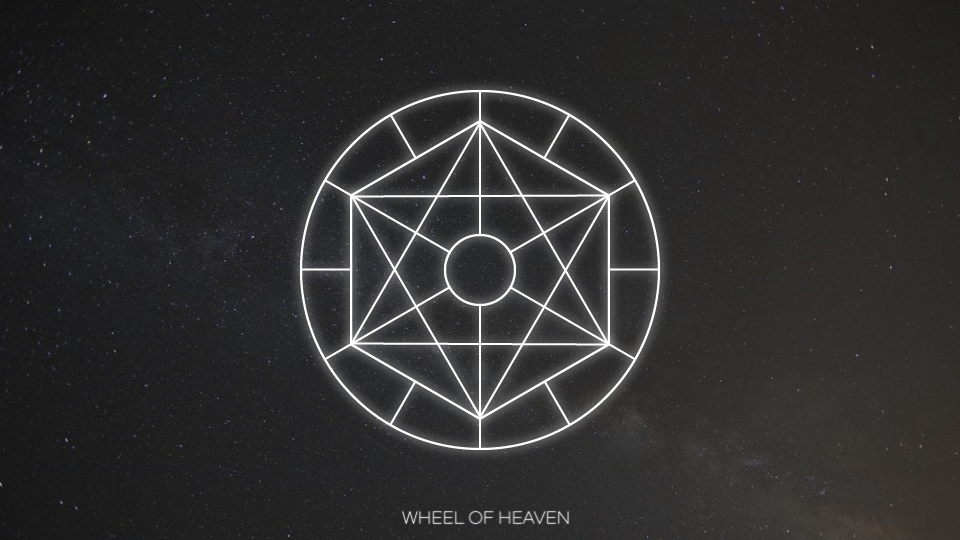

The third key motion of the Earth next to the cycles responsible for the day and the year is the precession of the equinoxes. Its cycle –the Great Year– lasts roughly 24’000 years. By dividing the cycle in 12 houses of 2’000 years, you would be given the key to understand the purpose of the zodiac being a time marker...

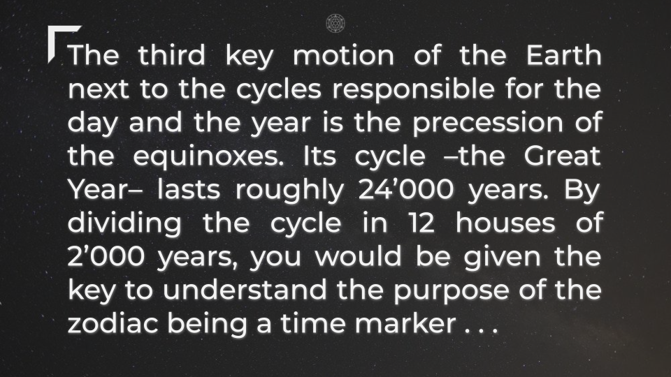

Constellations are star patterns used for navigating the night sky. This method of mapping the heavens dates back to prehistory, possibly even earlier.

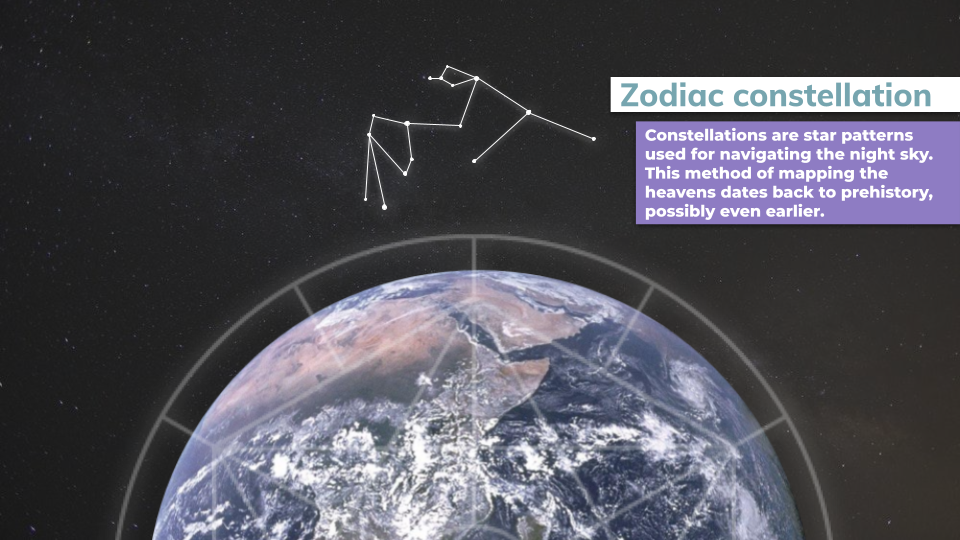

The Great Year tells an epic story of the origins of humanity across the time spans starting with the Age of Aquarius long ago.

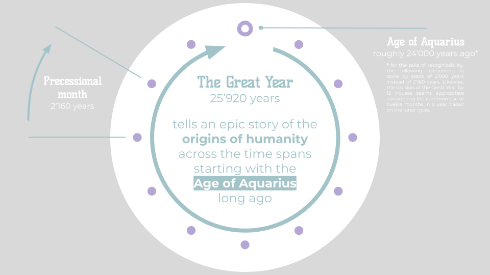

Intercultural understanding passed the climax, warmongering slowly faded away, nations united, science progressed immensely, technology and engineering enabled to produce a great abundance of goods and comfort.

In particular the possibilities of synthetic biology aroused the imagination of a lot of curious minds. The negligence of these early experiments cumulated in an outbreak of ferocious creatures. Consequently, this highly risky field of study was deemed unethical and thus banned. The researchers however didn’t abandon their curiosity and initiated a space exploration program to find a suitable place far away from the jurisdiction of their own government.

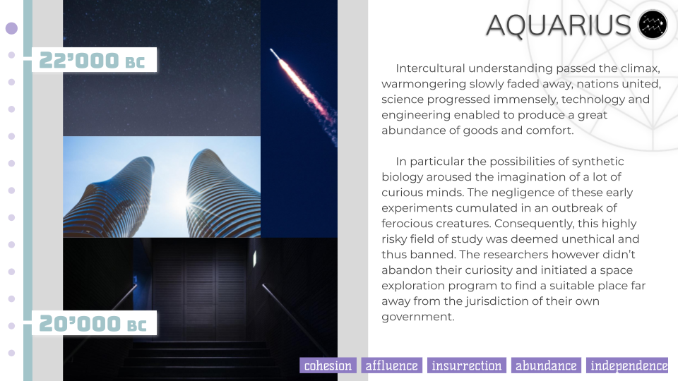
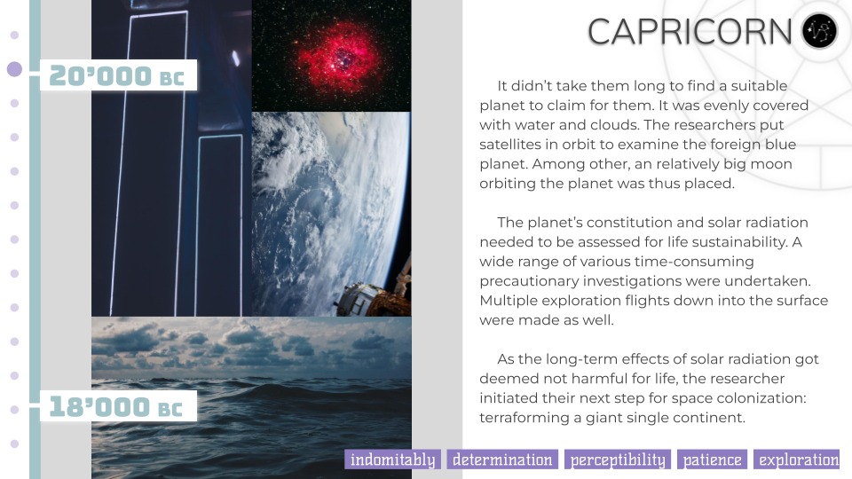
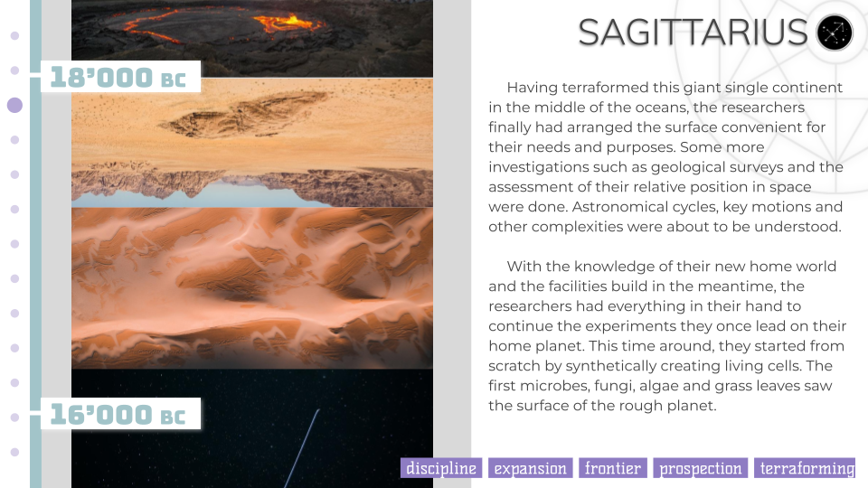
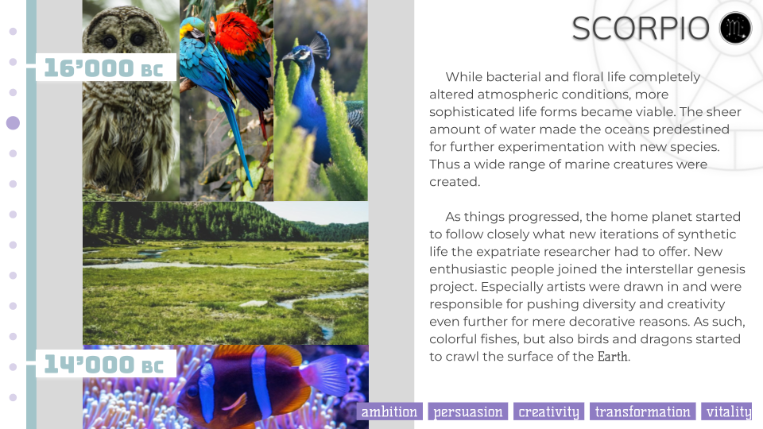
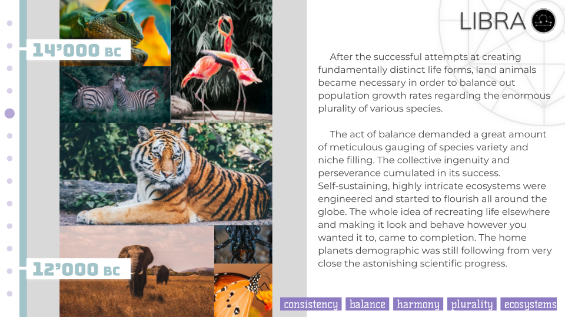
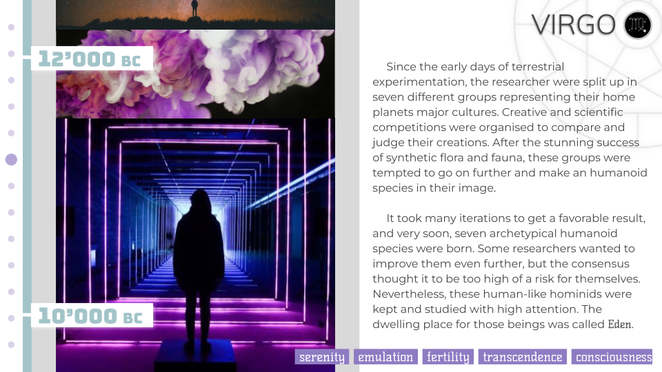
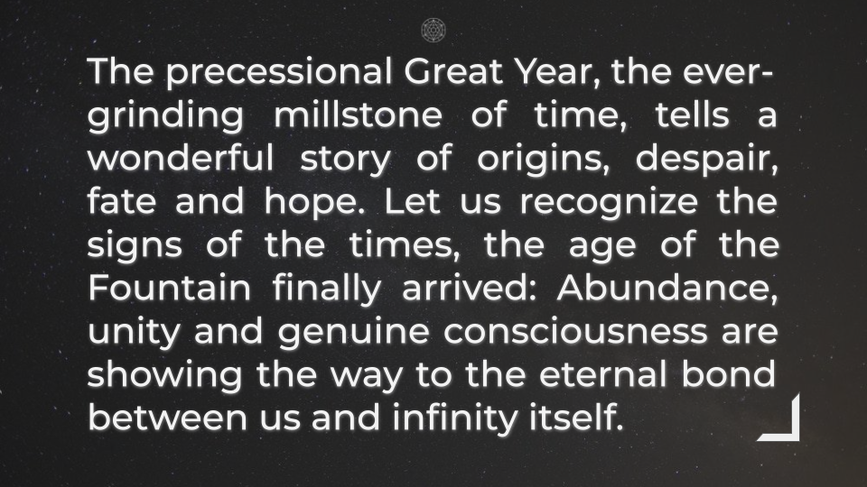

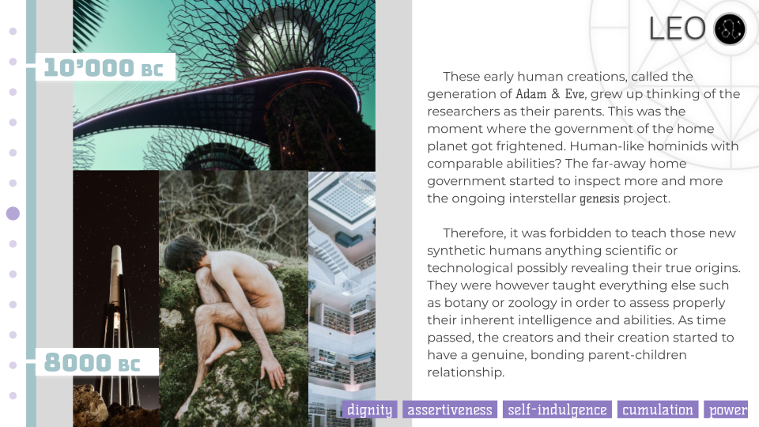
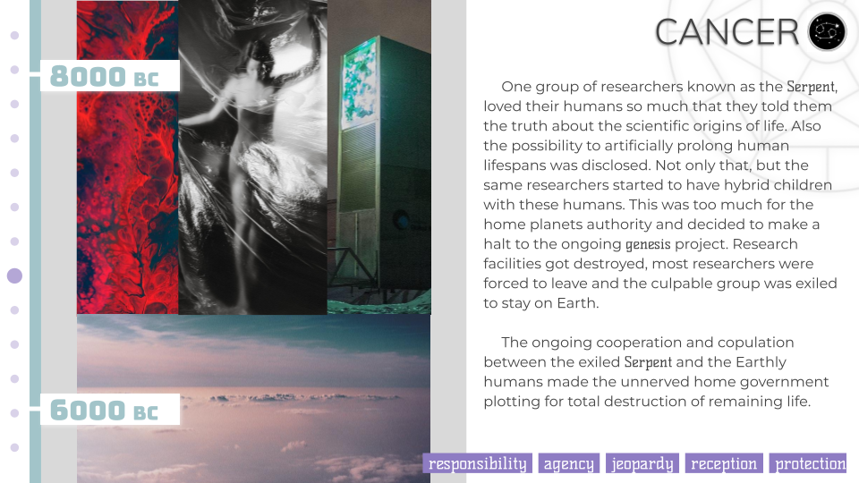
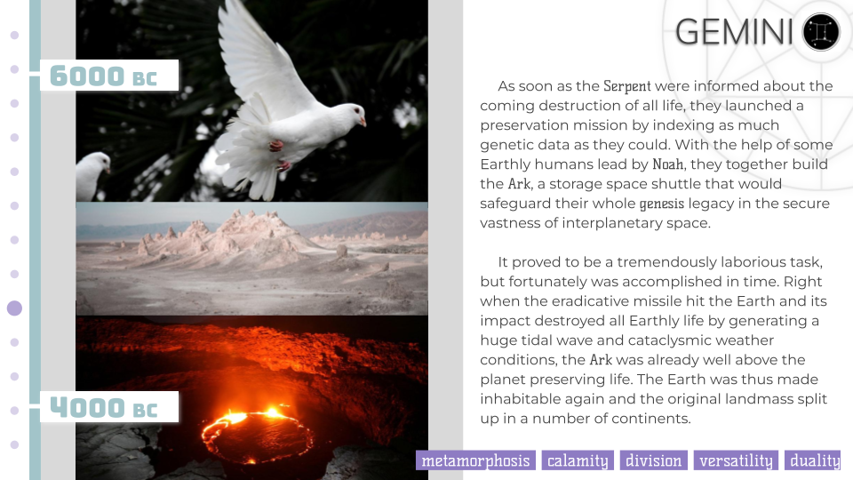

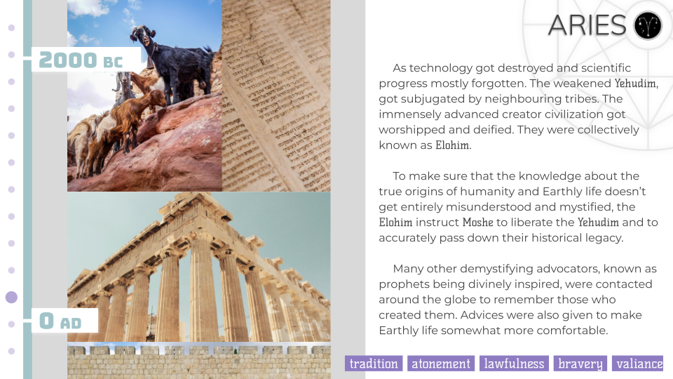
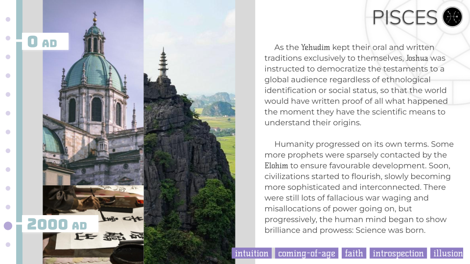
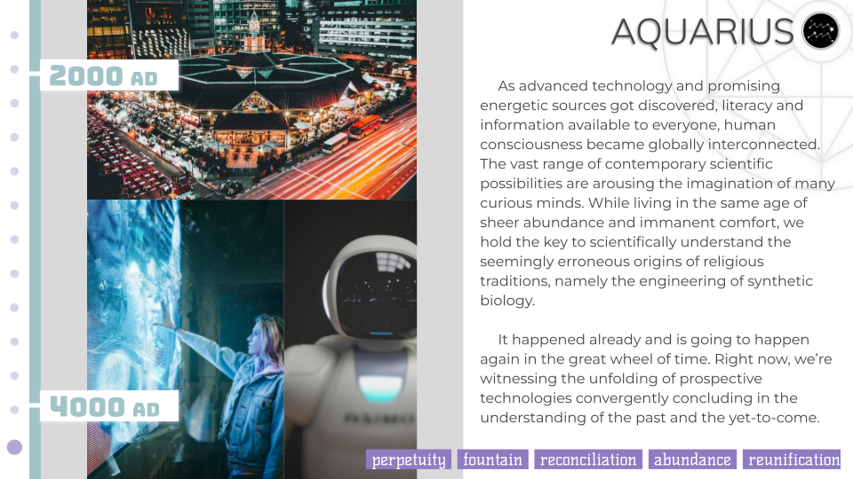
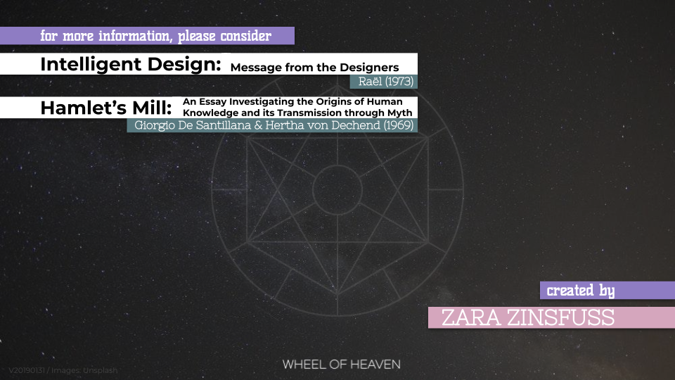
